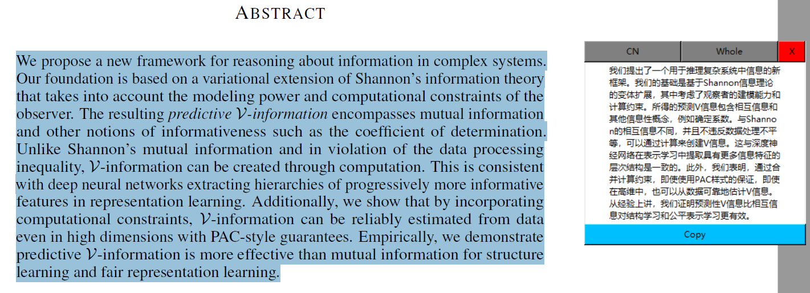

# 使用方法

## 准备

- 在***python***环境中执行:
  
  ```shell
  conda install swig
  pip install pyperclip, PyExecJS, PyHook3
  ```
  
- 把start.bat拷贝到任意一个你觉得方便的地方，比如桌面

- 将start.bat中第一个参数更改为你电脑中***python***所在的绝对位置

  - **注意**：两个***python***应该是同一个，也即环境要对应，建议装在base环境就好了

- 第二个参数更改为copyTranslate.py文件的绝对路径
## 使用

- 双击start.bat

- 如果正常生成了stop.bat，说明脚本正常工作

  - 如果未正常生成，需要在代码文件夹下进入python环境，执行以下指令，查看报错：

    ```shell
    python copyTranslate.py
    ```

- 在该状态中：
  - 每当你按下alt+Q，对剪切板进行一次翻译
  - 每当你按下alt+,，在整体翻译与分句翻译之间切换（默认为整体翻译）
  - 每当你按下alt+L，翻译语言在中英文之间切换（默认翻译为中文）
  - 快捷键可以在setting.json中设置, 请注意务必遵守规则

- 使用结束后，双击生成的stop.bat停止脚本

# 表现

脚本运行中, 每次复制会呈现如下场景
   
